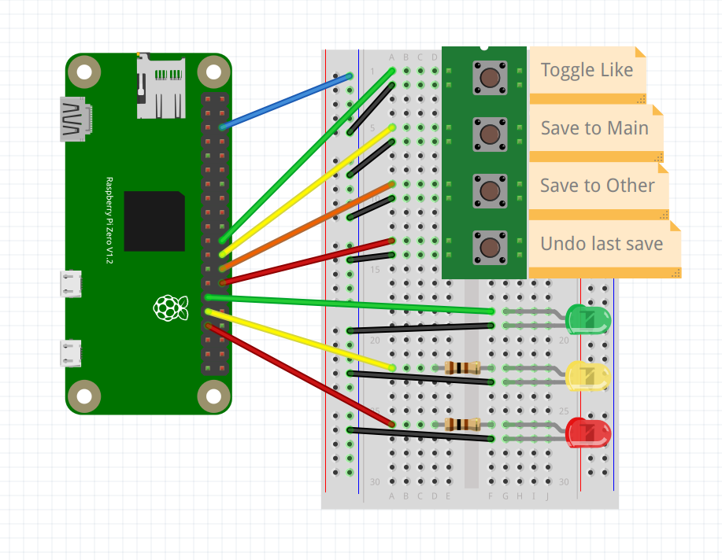

# Spotify QuickSave :zap: :notes:
[](https://www.gnu.org/licenses/gpl-3.0)
[](https://www.python.org/)
[](https://www.raspberrypi.com/)
[](https://developer.spotify.com/dashboard)

<!-- TODO: decide on the different terms you want to use and be strict about them.
for example, how you refer to a quicksave (pascal case, capital, lower, etc.)
or using QuickSaver to casually refer to the app. -->

Welcome to **Spotify QuickSave**! The RaspberryPi-powered Python app designed to enhance your music listening experience. It enables quick and effortless song saving with a quick button press, minimizing interruptions to your routine and keeping you focused.

I found that when I was doing work while listening to a new playlist I discovered on Spotify, I would keep finding new songs I loved and wanted to save to my library. The problem is that switching to the Spotify app every few minutes to add songs to my library was very disruptive to my workflow. This drove me to create **Spotify QuickSave**. With QuickSave all it takes is a quick press of a button and the currently playing song gets quickly saved to your library and a previously specified playlist. If you for some reason change your mind about saving that song, you can easily undo the last save with the push of another button.

This allows you to effortlessly save songs while you're browsing the web, doing homework, or even on a long drive. I actually found myself constantly needing QuickSave **_while_ I was developing it,** and I'm even using it as I write this README.

Ready to give it a try? Follow the detailed guide below to get started!

## License :penguin:
**Spotify QuickSave** is released under the [GNU General Public License v3.0](https://www.gnu.org/licenses/gpl-3.0.en.html). See the [LICENSE](LICENSE) file for more details.

## What I Learned :books:
- Programming self-sustaining embedded systems.
- Working with Raspberry Pis and designing circuits.
- Designing very robust system architecture and learning modular software design patterns.
- Automated system startup and operation using `systemd` for seamless, headless execution.
- Implemented robust mechanisms for autonomous error handling and logging.

## Getting Started :rocket:

### Prerequisites :package:
Before you can run the project, make sure you have the following dependencies installed:
- Python 3
- [Spotipy](https://pypi.org/project/spotipy/) | Spotify API wrapper | `pip install spotipy`
- [GPIO Zero](https://pypi.org/project/gpiozero/) | Raspberry Pi | `pip install gpiozero`

If you're still having trouble running QuickSaver, your Python version might be too old to use the required packages. Either install older versions of the packages that work with your version of Python, or upgrade your Python version.

### Raspberry Pi Setup :pie:
To begin, you will need a Raspberry Pi capable of running an Operating System; which is any RasPi except for the RasPi Pico. It is recommended that you install a light, headless OS on the RasPi you're using, such as **Raspberry Pi OS Lite**. Use [this tutorial](https://www.raspberrypi.com/documentation/computers/getting-started.html#installing-the-operating-system) from the official RaspberryPi site for installing an OS on your RasPi. Make sure to go through the [OS customisation section](https://www.raspberrypi.com/documentation/computers/getting-started.html#advanced-options) to configure the **wireless LAN (Wi-Fi)** and **enable SSH**. The wireless LAN is absolutely required to allow QuickSaver to communicate with the Spotify API, otherwise it can't run. It's also important, in combination with enabling SSH, to allow you to connect to your RasPi wirelessly through the terminal, which is especially important if you're running headlessly (without a display) which is the recommended configuration.

Once you have a RasPi with a working OS, you'll need to download this repository. If your RasPi is running headlessly as recommended, you'll need to SSH into your Pi to access it; which means opening a terminal session on the Pi through your local network. You can use the [following guide](https://www.raspberrypi.com/documentation/computers/remote-access.html) from the official RaspberryPi site to get started. Once SSHed into your Pi, use `git` to clone this repository to your RasPi.

Direct your attention to the `empty_config.json` file in the directory (folder) you just cloned from GitHub. You're going to be filling in this configuration file with information about your Spotify and Raspberry Pi setup as you go through the rest of the README. Start by renaming the file to `config.json`.

### Spotify API Setup :notes:
**Spotify QuickSave** uses the Spotify API, so you'll be required to create your own API keys on the [Spotify Developer Dashboard](https://developer.spotify.com/dashboard); don't worry, it's pretty simple!

Follow these steps if you need help:
1. Go to the [Spotify Developer Dashboard](https://developer.spotify.com/dashboard) and log in with your Spotify account.
2. Click on the _"Create an App"_ button and fill out the required fields.
3. After creating the app, open the _"Settings"_ tab to view your client ID and secret, you'll need them in the next step.
4. Go to the *Redirect URIs* field and add the following `http://localhost:8888/callback`

Once you have your client ID and secret, open the `config.json` file in the project directory and paste your client ID and secret in the appropriate spots. It looks like this:

```json
{
    "spotify": {
        "client_id": "CLIENT ID HERE",
        "client_secret": "CLIENT SECRET HERE",
        "redirect_uri": "http://localhost:8888/callback"  # <- DO NOT CHANGE THIS
    },
    ...
```

### Circuit Setup :zap:
The Raspberry Pi setup will require you to wire 4 buttons and 3 LEDs:
- **4 Buttons:**
  1. Toggle Like
  2. Save to main playlist
  3. Save to other playlist
  4. Undo last save
- **3 LEDs:**
  1. Green (for success signals)
  2. Yellow (for warnings)
  3. Red (for errors)

You can wire the circuit however you like, as long as you include the components listed above, with each one starting from a GPIO pin and ending at a ground pin; note what GPIO pins you use as they will need to be added to the `config.json` file.

Below is a schematic of how I wired the circuit as an example that you can copy (resistors between 60Ω and 100Ω are recommended). Whether you copy my circuit or wire it your own way, **DO SO AT YOUR OWN RISK**, because electronics can be dangerous and you may damage your hardware if you're not sure what you're doing. It's not that difficult but it's important to do the proper research and exercise caution.



Compare your circuit to a [GPIO pinout diagram](https://www.raspberrypi.com/documentation/computers/images/GPIO-Pinout-Diagram-2.png?hash=df7d7847c57a1ca6d5b2617695de6d46) to figure out the GPIO pin numbers you used, then fill them in in `config.json`. It looks like this:

```json
    ...
    "gpio_pins": {
        "led_success": 0, # Green LED
        "led_alert": 0,   # Yellow LED
        "led_error": 0,   # Red LED
        "button_toggle_like": 0,
        "button_save_main": 0,
        "button_save_other": 0,
        "button_undo_save": 0
    }
}
```

### OS Configuration & Automation :hammer_and_wrench:
You'll need to make some changes on your RasPi to allow **Spotify QuickSave** to run automatically. To make these changes, start by connecting to your RasPi computer by opening an SSH connection. We're going to be **(1)** editing your Wi-Fi network list and **(2)** setting up a service that automatically runs QuickSaver whenever your RasPi boots up.

#### Automatic Startup with systemd
To ensure that QuickSaver runs seamlessly and starts automatically whenever your Raspberry Pi boots up, we'll set up a `systemd` service. This service will manage the execution of the application in the background, providing reliable and continuous operation without the need for manual intervention.

<!-- 1. -->
A service file has been provided in this project directory. You will simply edit it with your details and then move it to `/etc/systemd/system/`, a directory containing all `systemd` services.

2. edit certain details

3. move to .../system/ directory

4. enable the service (optionally start it now)

#### Wi-Fi Configuration (optional)
You should've already configured the details of your Wi-Fi network when you first installed the OS on your RasPi, but you have the option to add more networks. This is important if you're going to use QuickSaver in different places with different Wi-Fi networks; your RasPi will have to have the details of any network it might use beforehand so that it can automatically connect to it when you plug it into power.

You can edit the file containing your network configuration by running the following command:
```shell
sudo nano /etc/wpa_supplicant/wpa_supplicant.conf
```

The file should initially look something like this:
```conf
country=US
ctrl_interface=DIR=/var/run/wpa_supplicant GROUP=netdev
update_config=1

network={
    ssid="YourNetworkSSID"
    psk="YourNetworkPassword"
    key_mgmt=WPA-PSK
}
```

**To add more networks,** simply copy the `network={...}` block and replace the SSID and password with the details of the network you trying to add. *The SSID is the name of the Wi-Fi, the same name you usually see when connecting your phone or laptop to Wi-Fi.* The RasPi tries to connect to these networks in the order they appear in the file. If the first network is unavailable, it moves on to the next network block, and so on.
```conf
...

network={
    ssid="1stPriorityNetwork"
    psk="password"
    key_mgmt=WPA-PSK
}

network={
    ssid="2ndPriorityNetwork"
    psk="password"
    key_mgmt=WPA-PSK
}
```

If desired, the **priority field** can be used to explicitly set which network the Raspberry Pi should prefer if multiple networks are available. A higher priority value means the network is preferred over others with lower values:
```conf
...

network={
    ssid="1stPriorityNetwork"
    psk="password"
    key_mgmt=WPA-PSK
    priority=2
}

network={
    ssid="2ndPriorityNetwork"
    psk="password"
    key_mgmt=WPA-PSK
    priority=1
}
```

### Spotify Playlist IDs (optional)
You might have noticed the following section in `config.json`:

```json
    ...
    "playlists": {
         "main_playlist": "LEAVE UNTOUCHED TO ALLOW QS TO AUTO CREATE",
         "other_playlist": "LEAVE UNTOUCHED TO ALLOW QS TO AUTO CREATE"
     },
    ...
```

**Spotify QuickSave** gives you the option to pick between 2 different playlists to save to. When you run the app, QuickSaver will grab the playlist IDs of these 2 playlist options from `config.json` and use them whenever you save a song. If the playlist configuration in `config.json` is left untouched, QuickSaver will automatically create new playlists on the first run of the app and update `config.json` with the new playlist IDs. Once created, you can edit the names, descriptions, and images of these playlists if desired; make sure to differentiate between the main playlist and the other playlist.

You can **optionally** set your own playlists by pressing "Share" on the playlist in Spotify and copying the link. It should look something like this: `https://open.spotify.com/playlist/<PLAYLIST_ID_HERE>?si=XXXXXXXXXXX`. Copy the playlist ID from the link and paste it in the appropriate spot in `config.json`; note which playlist you set to *main* and which playlist you set to *other*.

## Usage :technologist:
The purpose of **Spotify QuickSave** is to be able to easily and quickly save the *currently playing song* to your playlist and library with the press of a button, which I like to call a *"Quicksave"*. When a Quicksave is triggered, the currently playing song is liked (saved to your Spotify library) and added to the playlist specified in the config file.

Below are all the functions of QuickSaver:
1. **Toggle Like:** Likes/unlikes the currently playing song (in Spotify this means saving/unsaving it to your library).
2. **Save to Main:** QuickSaves the currently playing song to the "main" playlist.
3. **Save to Other:** QuickSaves the currently playing song to the "other" playlist.
4. **Undo Last Save:** Undoes the last save by unliking the song and removing it from the playlist it was QuickSaved to (main or other); this can not be performed more than once at a time, you will need to save another song before being able to undo.

**QuickSaving**  
QuickSaver allows you to save to 2 different playlists because sometimes you might want to differentiate between your regular saves and another category of saves. A common usage would be listening to a radio of mostly one genre, like pop, so that once your listening session was over, you could move all the quicksaved songs to your pop playlist. Oftentimes, you might come across one or two songs that are not pop songs (do not match the main genre). When this happens, you can instead quicksave the song to the ***other playlist*** while keeping the ***main playlist*** strictly for pop songs. Once you're less busy after your listening session, you can add the entire ***main playlist*** to your pop playlist, and sort the few songs in the ***other playlist*** to their respective playlists.

Another common usage would be to use the ***main playlist*** for songs you 100% would like to save, while using the ***other playlist*** for songs you might save. Once you're done with your listening session, you can come back to Spotify and give the other songs a second look and decide which ones you'd like to definitely save. The ideas are endless, it's up to you to decide how you want to use the 2 playlists.

**Undoing the Last QuickSave**  
If you change your mind about the song you just quicksaved, you can ***undo save*** to unlike it and remove it from the playlist it was saved to. **Note** that you can only undo one time after saving a song, meaning you won't be able to undo again until you quicksave another song.

**Toggle Like**  
In addition to quicksaving, you can simply ***toggle like*** to save (or unsave) the currently playing song to your Spotify library, without saving it to a playlist.

## LED Signal Guide :traffic_light:
<!-- # TODO: continue writing. -->
**Spotify QuickSave** makes use of 3 LEDs (green, yellow, red) to provide clear and immediate feedback from the app when you press buttons, such as successful saves, errors, and warnings. Here is what each signal means based on what button triggered it:

1. **Toggle Like**
   - Green flash :green_circle:: song was successfully **liked**
   - Green + yellow flash :green_circle::yellow_circle:: song was successfully **unliked**
   - 3 yellow flashes :yellow_circle::yellow_circle::yellow_circle:: warning, **no song** is currently playing to save
2. **Save to Main**
   - Green flash :green_circle:: song was successfully **quicksaved** to main playlist
   - Yellow flash :yellow_circle:: **duplicate warning**, song is already in main playlist
   - 3 yellow flashes :yellow_circle::yellow_circle::yellow_circle:: warning, **no song** is currently playing to save
3. **Save to Other** *(same as save to main)*
   - Green flash :green_circle:: song was successfully **quicksaved** to other playlist
   - Yellow flash :yellow_circle:: **duplicate warning**, song is already in other playlist
   - 3 yellow flashes :yellow_circle::yellow_circle::yellow_circle:: warning, **no song** is currently playing to save
4. **Undo Last Save**
   - Green + yellow flash :green_circle::yellow_circle:: last quicksave was successfully **undone**
   - Yellow flash :yellow_circle:: **max undo** warning, can't undo more than once in a row

**Ready Lights :green_circle::yellow_circle::red_circle::** When the Quicksaver app starts running, it will trigger an LED sequence using all the LEDs to signal **the app is up and running**.

**Red Error Flash :red_circle::** Very rarely you might see the red light flash alone which indicates a critical error. This might be caused by a failed request to the API, a missing `config.json` file, etc. It doesn't require any intervention from you, just make sure to avoid messing with any files you haven't been instructed to change to reduce the likelihood of errors.

## Important Consideration :warning:
QuickSave fetches the songs in your playlist at the start of each run of the app, and saves it in a local list. This list is used to keep track of the songs in your playlists to avoid adding duplicates, but the list is **NOT updated throughout the run of the app.** Meaning it does not re-fetch the songs from Spotify as you use the app, it only keeps track of the songs added using QuickSave. So if you remove or add a song manually from Spotify while the app is running, it will not account for that during the run, so be careful.

***
That's it! Now you're ready to use **Spotify-QuickSave** and get to jamming :headphones: :notes:
